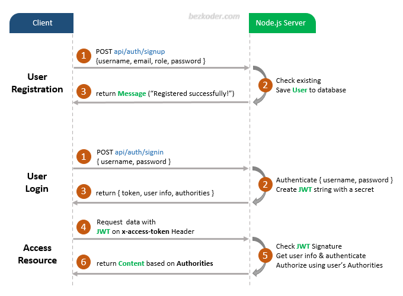

# Node.js – JWT Authentication example with PostgreSQL example

## User Registration, User Login and Authorization process.
The diagram shows flow of how we implement User Registration, User Login and Authorization process.




## Project setup
```
npm install
```

Then, edit `app/config/db.config.js` with correct DB credentials.

### Run
```
node server.js
```
curl -X POST http://localhost:3000/api/auth/login \
  -H "Content-Type: application/json" \
  -d '{
    "email": "user@example.com",
    "password": "password123"
  }'

https://pgadmin-archive.postgresql.org/pgadmin4/v6.15/windows/pgadmin4-6.15-x64.exe